# Output

## adding 3 tasks :
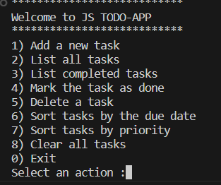
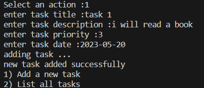
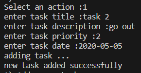
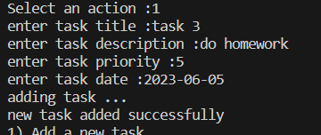

## list all tasks :
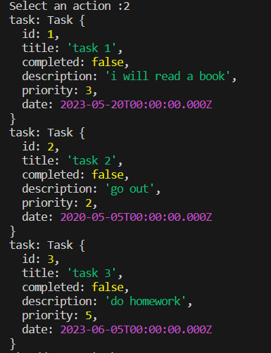

## mark task #3 as completed :
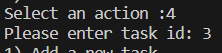

## list completed tasks :
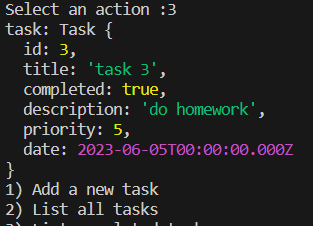

## sort tasks dou to date :
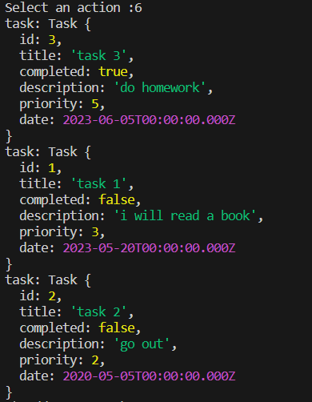

## sort tasks dou to priority :
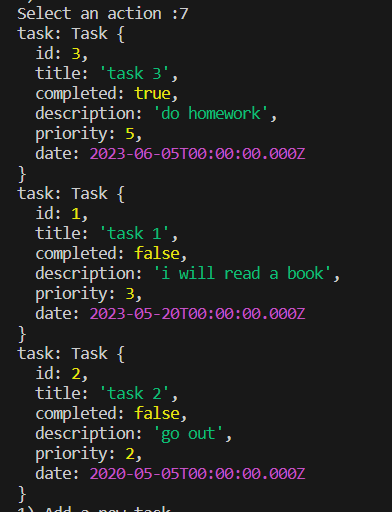

## delete task by id :
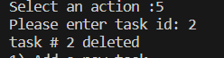

## check if the task deleted :
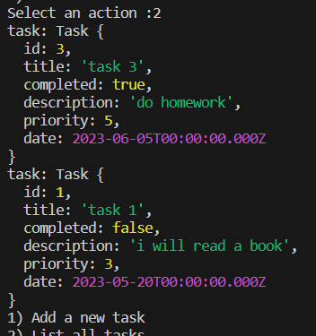

## delete all tasks :
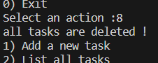

## check if all task have been deleted :
